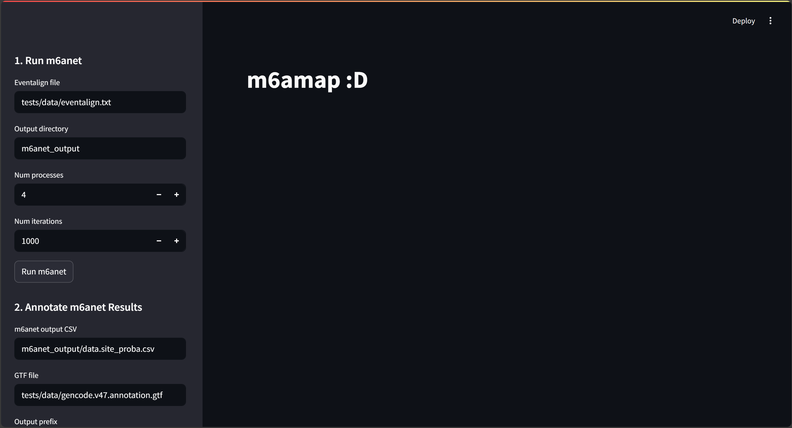
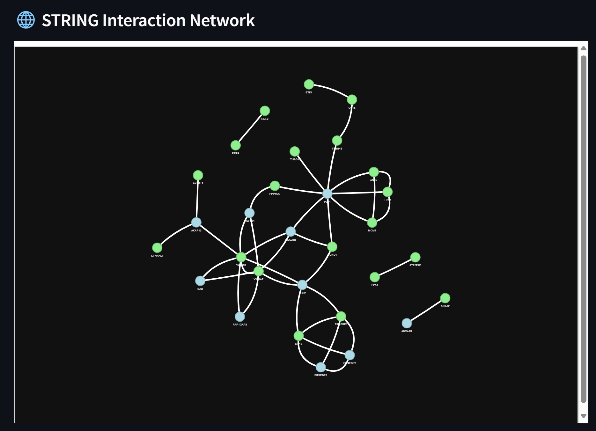
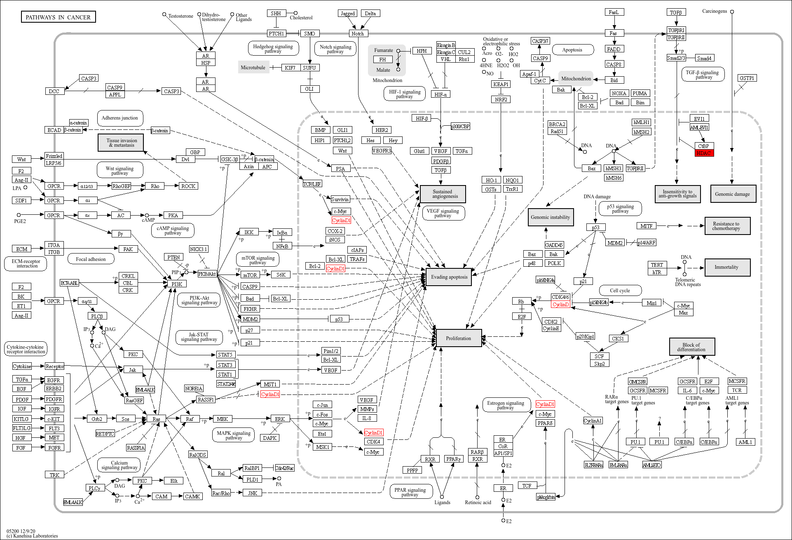
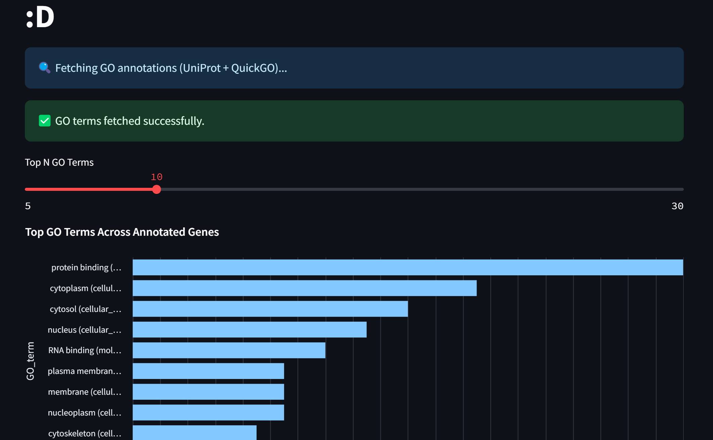

# **m6amap: m6A Modification Annotation and Pathway Mapping**  

related mini-project: https://github.com/nya0o0/m6alinker

## **1. Introduction**  

**m6a Modification**

RNA modification has been found to have biological importance in multiple aspects, and N6-methyladenosine (m6A) modification is the most abundant and prevalent mRNA and long non‐coding RNA (lncRNA) modification in eukaryotic cells. The m6A modification can affect mRNA splicing, stability, and translation and is found to play important roles in stem cells and multiple diseases. 

**What task will the project accomplish？**

This project integrate [**m6Anet**](https://m6anet.readthedocs.io/en/latest/), a tool that can detect m6A modification sites from direct RNA sequencing using a multiple instance learning framework, with other diseases and function related databases, including [**M6ADD**](http://m6add.edbc.org/), [**STRINGdb**](https://string-db.org/), [**KEGG**](https://www.genome.jp/kegg/) and [**QuickGO**](https://www.ebi.ac.uk/QuickGO/)into a unified pipeline that takes **nanopore sequencing data** as input and outputs **predicted RNA modification sites (m6A) with genome position and geene symbols**, as well as their **associated diseases, genes, and pathways**, with interactive website and visualizations for better interpretability.  

**Why is this useful?**  

- **Biomedical Insights**: This project links m6A sites to diseases, genes, and pathways, helping researchers better understand a more comperhansive map of RNA modifications in disease progression.  
- **Interactive Data Exploration**: Users will explore results dynamically using interactive graphs, making it easier to identify patterns and correlations.  

---

## **2. User Input and Data Requirements**  

**User Input**  
The user will provide:  

- **Eventalign data** (TXT format)
`eventalign.txt` is an output file from the [**nanopolish eventalign**](https://github.com/jts/nanopolish) command, which aligns raw nanopore signal data (events) to a reference genome or transcriptome and provides detailed information about how the electrical signals correspond to specific k-mers in the reference.
    **Sample Format of `eventalign` File**

    | contig            | position | reference_kmer | read_index | strand | event_index | event_level_mean | event_stdv | event_length | model_kmer | model_mean | model_stdv | standardized_level | start_idx | end_idx |
    |--------------------|----------|----------------|------------|--------|-------------|------------------|------------|--------------|------------|------------|------------|--------------------|-----------|---------|
    | ENST00000361055.8 | 551      | TGGAC          | 82380      | t      | 1093        | 125.2            | 2.364      | 0.00299      | TGGAC      | 118.05     | 3.17       | 2.07               | 66904     | 66913   |
    | ENST00000361055.8 | 552      | GGACT          | 82380      | t      | 1094        | 122.49           | 4.523      | 0.00764      | GGACT      | 123.83     | 4.79       | -0.26              | 66881     | 66904   |
    | ENST00000361055.8 | 553      | GACTC          | 82380      | t      | 1095        | 92.61            | 2.74       | 0.00498      | GACTC      | 88.67      | 2.73       | 1.32               | 66866     | 66881   |
    | ENST00000361055.8 | 546      | TGGAC          | 82382      | t      | 1388        | 119.66           | 3.6        | 0.00332      | TGGAC      | 118.05     | 3.17       | 0.47               | 92966     | 92976   |
    | ENST00000361055.8 | 547      | GGACT          | 82382      | t      | 1389        | 124.2            | 8.115      | 0.00498      | GGACT      | 123.83     | 4.79       | 0.07               | 92951     | 92966   |


---


- **Refernece anotated genome data** (GTF format)
  Downloaded from GENCODE release. (Example: [gencode.v47.annotation.gtf](https://ftp.ebi.ac.uk/pub/databases/gencode/Gencode_human/release_47/gencode.v47.annotation.gtf.gz))

**Data Sources**  
- **Nanopore sequencing data** (provided by the user)  
- **GENCODE refernece anotated genome data** from gencode release.([Example](https://ftp.ebi.ac.uk/pub/databases/gencode/Gencode_human/release_47/gencode.v47.annotation.gtf.gz))
- **M6ADD** database for linking modifications to diseases, genes, and pathways ([M6ADD Database](https://m6add.org))  
- **Database API** 
  - **Gene Ontology API (via QuickGO)**  https://www.ebi.ac.uk/QuickGO/
  - **KEGG API**  https://www.kegg.jp/kegg/rest/keggapi.html 
  - **STRING API** https://string-db.org/help/api/

---

## **3. How Users Will Interact with the Program**   

**Web-based Interactive Dashboard** create by [**streamlit**](https://streamlit.io/) package.  

 
---

## **4. Expected Output Format & Interactive Visualization**  

**Text Output Example (CSV)**  

**Annotated m6Anet results (CSV) with genome positions, involved genes and related disease of the m6a modification sites:**

| transcript_id     | transcript_position | n_reads | probability_modified | kmer  | mod_ratio           | genome_pos | chromosome | dist_up_exon_junc | dist_down_exon_junc | region | gene_name | transcript_type | m6add_Disease            | m6add_Symbol_id | m6add_chr | m6add_strand | m6add_start | m6add_end | m6add_p_value | m6add_logFC   | m6add_GSE      | m6add_Treat_method    | m6add_genome_pos |
|--------------------|---------------------|---------|-----------------------|-------|---------------------|------------|------------|--------------------|---------------------|--------|-----------|-----------------|--------------------------|-----------------|-----------|--------------|-------------|------------|---------------|----------------|----------------|-----------------------|------------------|
| ENST00000216129   | 1091               | 23      | 0.8442736864089966    | GGACT | 0.3043478260869565 | 43167069   | 22         | 1091.0            | 446.0               | CDS    | TTLL12    | protein_coding  | Acute monocytic leukemia | TTLL12          | 22        | -            | 43167020    | 43167118   | 0.000612042   | -3.068052935   | GSE87190       | MA9.3RAS R-2HG        | 43167069         |
| ENST00000248879   | 889                | 42      | 0.957377791404724     | GGACT | 0.6666666666666666 | 20319740   | 22         | 60.0              | 100.0               | UTR3   | DGCR6L    | protein_coding  | Acute monocytic leukemia | DGCR6L          | 22        | -            | 20319712    | 20319761   | 0.023999396   | 1.343734747    | GSE87190       | MA9.3ITD shNS-1-R-2HG | 20319736         |
| ENST00000251413   | 1534               | 77      | 0.9866690635681152    | GGACT | 0.8831168831168831 | 42615164   | 17         | 321.0             | 73.0                | UTR3   | TUBG1     | protein_coding  | Acute monocytic leukemia | TUBG1           | 17        | +            | 42615136    | 42615185   | 0.002256581   | -4.624972813   | GSE87190       | MA9.3RAS R-2HG        | 42615160         |
| ENST00000254799   | 965                | 45      | 0.3037236928939819    | GGACT | 0.1111111111111111 | 70819897   | 4          | 965.0             | 4113.0              | CDS    | GRSF1     | protein_coding  | Acute monocytic leukemia | GRSF1           | 4         | -            | 70819874    | 70819923   | 0.018212655   | -1.21302264    | GSE87190       | MA9.3RAS R-2HG        | 70819898         |
| ENST00000258383   | 1316               | 20      | 0.1781741976737976    | GGACT | 0.05               | 223967341  | 2          | 479.0             | 372.0               | UTR3   | MRPL44    | protein_coding  | Acute monocytic leukemia | MRPL44          | 2         | +            | 223967315   | 223967364  | 0.007863882   | -3.295836866   | GSE87190       | MA9.3RAS R-2HG        | 223967339        |

**Visualization**  

**1. Network Graph (m6A Sites → Genes → Diseases → Pathways)**  
- **Nodes**: genes
- **Edges**: Relationships between them



**2. KEGG pathways list and pathway maps**  

- **KEGG gene IDs and their related pathways list**

|   | KEGG Gene ID | Pathway ID |
|---|--------------|------------|
| 0 | 513          | map00190   |
| 1 | 513          | map01100   |
| 2 | 513          | map04714   |
| 3 | 513          | map05208   |
| 4 | 513         | map05415   |
| 5 | 6449        | map03060   |
| 6 | 595         | map01522   |
| 7 | 595         | map04068   |
| 8 | 595         | map04110   |

- **KEGG pathway map**




**3. GO enrichment chart**  


  
---
## **5. What other tools currently exist to do this task, or something similar?**

There are several tools that can predict m6a modification sites and also databases that annotate modification sites, but this project try to link this two kinds of tools.

---
## **6. Dependencies** 

**6.1 Python Libraries**

The following Python libraries are required for the project:

| Library           | Purpose                                                                                     |
|--------------------|---------------------------------------------------------------------------------------------|
| `pandas`          | Data manipulation and analysis                                                              |
| `numpy`           | Numerical computations                                                                      |
| `gffutils`        | Parsing and querying GTF files                                                              |
| `requests`        | HTTP requests for interacting with external APIs                                            |
| `streamlit`       | Building the interactive web application                                                    |
| `pyvis`           | Creating interactive network visualizations                                                 |
| `altair`          | Data visualization                                                                          |
| `beautifulsoup4`  | Parsing and extracting information from HTML/XML (used in KEGG pathway fetching)            |
| **`m6anet`**      | Specialized tool for m6A modification analysis, used for data preparation and inference      |

---

## **7. Usage** 

**1. Dependencies installation**


```bash
git clone https://github.com/nya0o0/project
cd  project
pip install -r requirement.txt
```


**2. Run website**

```bash
streamlit run m6amap.py
```
**3. Cloud version**


---

## **8. Future Goals**

**Automated Summary Descriptions**
- **Goal**: Automatically generate integrated summary reports by combining outputs from the existing analytical modules (disease associations, pathways, orthology, and protein-protein interactions) and providing human-readable descriptions of results.
- **Possible Methods**:
  1. **Cross-referencing with Databases**:
     - Cross-reference results with external disease-focused databases like **OMIM**, **DisGeNET**, or **ClinVar** to enhance the biological and clinical relevance of the summary.
     - Combine the results into a structured format using Python libraries like `pandas`.

  2. **Integration with LLM APIs**:
     - Leverage **LLM APIs** to analyze and summarize the extracted data:
       - Send the outputs from STRING, KEGG, and QuickGO to the LLM for contextual interpretation.
       - Ask the LLM to generate **natural language summaries** of the findings.


